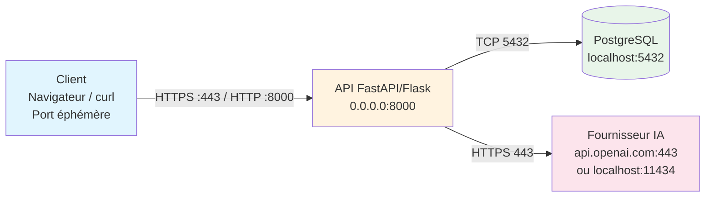

# Jour 2 — Mardi 8 septembre : Linux, Scripting Bash & Réseau

## 1. Résumé exécutif

Ce deuxième jour pose les fondations techniques indispensables pour tout ingénieur DevSecOps : maîtriser l'environnement Linux en ligne de commande, comprendre comment les données circulent sur le réseau (modèles OSI/TCP-IP, DNS, HTTP), et savoir automatiser ces interactions via des scripts Bash robustes. L'après-midi est consacrée au **Jalon 2** du fil rouge : modéliser l'architecture réseau complète du projet Bootcamp (client → API → base de données → fournisseur IA) et livrer deux scripts d'automatisation (initialisation + lancement) ainsi qu'une documentation des ports et variables d'environnement.

---

## 2. Objectifs pédagogiques

À la fin de la journée, vous devez être capable de :

| Compétence | Indicateur de réussite |
|------------|------------------------|
| **Navigation & droits Linux** | Se déplacer dans l'arborescence, lire/écrire des fichiers, appliquer `chmod`/`chown` sans erreur |
| **Réseau fondamental** | Expliquer le rôle de chaque couche OSI/TCP-IP, résoudre un nom DNS, identifier le port d'un service |
| **Inspection réseau** | Utiliser `curl`, `ping`, `netstat`/`ss`, les DevTools navigateur pour diagnostiquer une requête HTTP |
| **Scripting Bash** | Écrire un script idempotent avec variables, fonctions, gestion d'erreurs (`set -euo pipefail`) |
| **Architecture système** | Produire un schéma clair client→API→BDD→IA avec ports et flux de données |
| **Automatisation** | Livrer `init.sh` (installation dépendances, configuration) et `run.sh` (lancement ordonnancé des services) |

---

## 3. Détaillage horaire détaillé

### 09h00 – 09h40 : CLI Linux & Fondamentaux réseau

**Arborescence & navigation**  
```bash
pwd                    # Répertoire courant
ls -la                 # Liste détaillée (cachés + droits)
cd /var/log            # Chemin absolu
cd ../..               # Chemin relatif (remonter de 2 niveaux)
find /etc -name "*.conf"  # Recherche récursive
```

**Droits & propriété**  
```bash
chmod 750 script.sh    # rwx pour user, rx pour groupe, rien pour autres
chown user:group fichier  # Change propriétaire:groupe
ls -l                  # Vérifier : -rwxr-x--- user group
```

**Modèle OSI (7 couches) vs TCP-IP (4 couches)**

| OSI | TCP-IP | Rôle | Exemple concret |
|-----|--------|------|-----------------|
| 7 Application | Application | Interface utilisateur | HTTP, DNS, SSH |
| 6 Présentation | | Chiffrement, encodage | TLS, JSON, gzip |
| 5 Session | | Gestion dialogues | Cookies, JWT |
| 4 Transport | Transport | Fiabilité, ports | TCP (port 80/443), UDP (53) |
| 3 Réseau | Internet | Routage, IP | IPv4/IPv6, ICMP (ping) |
| 2 Liaison | Liaison | Trames, MAC | Ethernet, WiFi |
| 1 Physique | | Signaux électriques | Câble, fibre, ondes |

**Adressage & ports**  
- **IP publique** : identifie votre réseau sur Internet (ex. `142.250.180.46` pour google.com)  
- **IP privée** : RFC 1918 (`10.0.0.0/8`, `172.16.0.0/12`, `192.168.0.0/16`) — utilisée en local / Docker  
- **Ports** : 0–1023 (système, root), 1024–49151 (enregistrés), 49152–65535 (éphémères)  
- **Ports clés** : 22 (SSH), 53 (DNS), 80 (HTTP), 443 (HTTPS), 3306 (MySQL), 5432 (PostgreSQL), 6379 (Redis), 8080/8000/3000 (dev)

**DNS & résolution**  
```bash
dig +short google.com        # A record (IPv4)
dig AAAA google.com          # IPv6
dig MX ovh.com               # Serveurs mail
host api.monservice.local    # Résolution locale (via /etc/hosts ou DNS interne)
```

**Requêtes HTTP/HTTPS**  
```bash
curl -v https://api.github.com/users/octocat   # Verbeux : headers, TLS, corps
curl -X POST -H "Content-Type: application/json" -d '{"key":"val"}' https://httpbin.org/post
```

---

### 09h40 – 10h30 : Manipulation CLI & Inspection réseau

**Scripts Bash d'automatisation — Bonnes pratiques**  
```bash
#!/usr/bin/env bash
set -euo pipefail          # Arrêt si erreur, variable non définie, pipe qui échoue
IFS=$'\n\t'                # Internal Field Separator sûr

log_info()  { echo -e "\033[1;34[INFO]\033[0m  $*"; }
log_warn()  { echo -e "\033[1;33[WARN]\033[0m  $*"; }
log_error() { echo -e "\033[1;31[ERROR]\033[0m $*"; }

main() {
    log_info "Démarrage de l'initialisation..."
    # Corps du script
}
main "$@"
```

**Outils d'inspection réseau**  
```bash
# Connectivité de base
ping -c 3 8.8.8.8                # ICMP (couche 3)
ping -c 3 google.com             # Test DNS + ICMP

# Ports & services en écoute
ss -ltnp                         # TCP listen + PID + process (moderne)
netstat -ltnp                    # Équivalent legacy
lsof -i :8080                    # Qui écoute sur le port 8080 ?

# Requêtes HTTP complètes
curl -v -H "Authorization: Bearer $TOKEN" https://api.service/health
# -v : verbose (requête + réponse headers)
# -I : HEAD only (pas de body)
# --resolve api.local:443:127.0.0.1 : forcer résolution locale (utile Docker)

# DevTools navigateur (F12)
# Onglet Network : méthode, URL, status, headers, payload, timing (DNS, TCP, TLS, TTFB, download)
# Filtres : "Fetch/XHR", "Doc", "WS" (WebSocket)
```

**Exercice guidé : diagnostiquer un service qui ne répond pas**  
1. `ping <ip>` → OK ? → couche 3 OK  
2. `telnet <ip> <port>` ou `nc -zv <ip> <port>` → port ouvert ?  
3. `curl -v http://<ip>:<port>/health` → HTTP 200 ?  
4. Si échec : logs du service (`journalctl -u <service> -f` ou `docker logs <container>`)

---

### 10h30 – 11h30 : Fil rouge · Jalon 2 — Architecture réseau & Scripts

**Contexte** : Le projet Bootcamp expose une API REST (port 8000) qui persiste en PostgreSQL (5432) et appelle un fournisseur IA externe (ex. OpenAI, Mistral, ou modèle local via Ollama sur 11434).

**Schéma attendu (format Mermaid / draw.io / Excalidraw)**



**Points d'attention sur le schéma**  
- Distinguer **localhost hôte** (`127.0.0.1` machine) vs **localhost conteneur** (chaque conteneur a son propre `127.0.0.1`) → utiliser `host.docker.internal` ou l'IP Docker (`172.17.0.1`) ou le nom du service Docker Compose  
- Chaque flèche = un flux réseau avec **protocole + port**  
- Noter les variables d'environnement critiques sur chaque composant

**Script d'initialisation — `scripts/init.sh`**  
```bash
#!/usr/bin/env bash
set -euo pipefail

PROJECT_ROOT="$(cd "$(dirname "${BASH_SOURCE[0]}")/.." && pwd)"
ENV_FILE="$PROJECT_ROOT/.env"

log_info() { echo -e "\033[1;34m[INFO]\033[0m  $*"; }

main() {
    log_info "=== Initialisation Projet Bootcamp ==="
    
    # 1. Vérifier prérequis
    command -v docker >/dev/null || { log_error "Docker absent"; exit 1; }
    command -v docker compose >/dev/null || { log_error "Docker Compose absent"; exit 1; }
    
    # 2. Créer .env depuis .env.example si absent
    if [[ ! -f "$ENV_FILE" ]]; then
        cp "$PROJECT_ROOT/.env.example" "$ENV_FILE"
        log_info "Fichier .env créé depuis .env.example — À COMPLÉTER"
    fi
    
    # 3. Générer secrets si manquants
    grep -q '^SECRET_KEY=' "$ENV_FILE" || \
        echo "SECRET_KEY=$(openssl rand -hex 32)" >> "$ENV_FILE"
    grep -q '^DB_PASSWORD=' "$ENV_FILE" || \
        echo "DB_PASSWORD=$(openssl rand -hex 16)" >> "$ENV_FILE"
    
    # 4. Construire / puller les images
    log_info "Construction des images Docker..."
    docker compose -f "$PROJECT_ROOT/docker-compose.yml" build --pull
    
    # 5. Démarrer la BDD seule pour migrations
    log_info "Démarrage base de données..."
    docker compose -f "$PROJECT_ROOT/docker-compose.yml" up -d db
    sleep 3  # Attendre readiness (améliorable avec healthcheck)
    
    # 6. Migrations Alembic / SQL
    log_info "Application migrations..."
    docker compose -f "$PROJECT_ROOT/docker-compose.yml" run --rm api alembic upgrade head
    
    log_info "=== Initialisation terminée ==="
    log_info "Lancez './scripts/run.sh' pour démarrer l'ensemble."
}

main "$@"
```

**Script de lancement — `scripts/run.sh`**  
```bash
#!/usr/bin/env bash
set -euo pipefail

PROJECT_ROOT="$(cd "$(dirname "${BASH_SOURCE[0]}")/.." && pwd)"
COMPOSE_FILE="$PROJECT_ROOT/docker-compose.yml"

log_info() { echo -e "\033[1;34m[INFO]\033[0m  $*"; }
log_warn() { echo -e "\033[1;33m[WARN]\033[0m  $*"; }

# Nettoyage à l'arrêt (SIGINT/SIGTERM)
cleanup() {
    log_warn "Arrêt demandé — arrêt des conteneurs..."
    docker compose -f "$COMPOSE_FILE" down
    exit 0
}
trap cleanup SIGINT SIGTERM

main() {
    log_info "=== Lancement Projet Bootcamp ==="
    
    # Vérifier .env
    [[ -f "$PROJECT_ROOT/.env" ]] || { log_error "Fichier .env manquant — lancez ./scripts/init.sh"; exit 1; }
    
    # Charger variables pour affichage
    set -a; source "$PROJECT_ROOT/.env"; set +a
    
    log_info "Configuration détectée :"
    log_info "  API_PORT=${API_PORT:-8000}"
    log_info "  DB_PORT=${DB_PORT:-5432}"
    log_info "  OLLAMA_PORT=${OLLAMA_PORT:-11434}"
    log_info "  ENVIRONMENT=${ENVIRONMENT:-development}"
    
    # Démarrage orchestré
    log_info "Démarrage de tous les services..."
    docker compose -f "$COMPOSE_FILE" up --remove-orphans
    
    # Si on arrive ici (mode detached), afficher les URLs
    # docker compose up -d  # si détaché
    # log_info "API disponible sur http://localhost:${API_PORT:-8000}"
    # log_info "Docs Swagger : http://localhost:${API_PORT:-8000}/docs"
}

main "$@"
```

**Liste des ports & variables d'environnement (extrait `.env.example`)**  

| Variable | Description | Défaut | Requis |
|----------|-------------|--------|--------|
| `API_PORT` | Port exposition API (hôte) | `8000` | Oui |
| `API_HOST` | Bind address API | `0.0.0.0` | Oui |
| `DB_PORT` | Port PostgreSQL (hôte) | `5432` | Oui |
| `DB_NAME` | Nom base de données | `bootcamp` | Oui |
| `DB_USER` | Utilisateur BDD | `app` | Oui |
| `DB_PASSWORD` | Mot de passe BDD | *(généré)* | Oui |
| `DATABASE_URL` | URL SQLAlchemy complète | `postgresql://app:pass@db:5432/bootcamp` | Auto |
| `SECRET_KEY` | Clé signature JWT/cookies | *(généré)* | Oui |
| `OLLAMA_PORT` | Port Ollama local (si utilisé) | `11434` | Optionnel |
| `OPENAI_API_KEY` | Clé API OpenAI | — | Si provider cloud |
| `ENVIRONMENT` | `development` / `staging` / `production` | `development` | Oui |
| `LOG_LEVEL` | `DEBUG`, `INFO`, `WARNING` | `INFO` | Non |

**Fichier `docker-compose.yml` (squelette)**  
```yaml
version: "3.9"
services:
  api:
    build: ./api
    ports: ["${API_PORT:-8000}:8000"]
    environment:
      - DATABASE_URL=postgresql://${DB_USER}:${DB_PASSWORD}@db:5432/${DB_NAME}
      - SECRET_KEY=${SECRET_KEY}
      - ENVIRONMENT=${ENVIRONMENT}
      - LOG_LEVEL=${LOG_LEVEL:-INFO}
    depends_on:
      db:
        condition: service_healthy
    volumes:
      - ./api:/app  # Hot reload dev
  
  db:
    image: postgres:16-alpine
    ports: ["${DB_PORT:-5432}:5432"]
    environment:
      - POSTGRES_DB=${DB_NAME}
      - POSTGRES_USER=${DB_USER}
      - POSTGRES_PASSWORD=${DB_PASSWORD}
    volumes:
      - pgdata:/var/lib/postgresql/data
    healthcheck:
      test: ["CMD-SHELL", "pg_isready -U ${DB_USER} -d ${DB_NAME}"]
      interval: 5s
      timeout: 3s
      retries: 10
  
  ollama:
    image: ollama/ollama:latest
    ports: ["${OLLAMA_PORT:-11434}:11434"]
    volumes:
      - ollama_data:/root/.ollama
    profiles: ["local-ai"]  # Démarrage optionnel : docker compose --profile local-ai up

volumes:
  pgdata:
  ollama_data:
```

---

### 11h30 – 12h00 : Débrief & Q&A

**Points clés à retenir**  
- **Chemin absolu** : commence par `/` (`/home/user/projet/script.sh`) — indépendant du répertoire courant  
- **Chemin relatif** : ne commence pas par `/` (`./script.sh`, `../config.yaml`) — dépend du `pwd`  
- **Variable d'environnement** : `export VAR=valeur` (shell courant + enfants), `VAR=valeur ./script.sh` (uniquement pour ce processus)  
- **Port déjà utilisé** : `lsof -i :8000` → `kill -9 <PID>` ou changer le port dans `.env`  
- **Localhost piège** : dans un conteneur, `localhost` = le conteneur lui-même, pas l'hôte → utiliser `host.docker.internal` (Docker Desktop) ou le nom du service Compose (`db`, `api`)

**Questions fréquentes**  
> *Q : Mon script `init.sh` échoue sur `docker compose build`.*  
> R : Vérifiez que le Dockerfile existe, que vous êtes dans le bon répertoire (contexte de build), et que l'utilisateur est dans le groupe `docker` (`groups $USER`).

> *Q : `curl` me renvoie `Connection refused` sur `localhost:8000`.*  
> R : Le service écoute-t-il sur `0.0.0.0:8000` (pas `127.0.0.1:8000`) ? Le conteneur mappe-t-il bien le port hôte (`ports: ["8000:8000"]`) ?

> *Q : Comment partager un secret entre scripts sans l'écrire en dur ?*  
> R : `.env` (chargé via `source .env` ou `docker compose --env-file`), ou mieux : gestionnaire de secrets (HashiCorp Vault, AWS Secrets Manager, Doppler) en production.

---

## 4. Concepts clés — Fiches de révision

### Modèle OSI — Mnémotechnique : **A**ll **P**eople **S**eem **T**o **N**eed **D**ata **P**rocessing
| Couche | Nom | PDU | Équipement | Protocoles |
|--------|-----|-----|------------|------------|
| 7 | Application | Data | Passerelle | HTTP, DNS, SSH, SMTP |
| 6 | Présentation | Data | | TLS/SSL, JPEG, MPEG |
| 5 | Session | Data | | RPC, NetBIOS |
| 4 | Transport | Segment | | TCP, UDP, QUIC |
| 3 | Réseau | Paquet | Routeur | IP, ICMP, OSPF, BGP |
| 2 | Liaison | Trame | Switch | Ethernet, WiFi (802.11), PPP |
| 1 | Physique | Bit | Câble, Hub | RJ45, Fibre, Radio |

### Modèle TCP-IP (4 couches) — Correspondance
1. **Application** = OSI 5+6+7  
2. **Transport** = OSI 4  
3. **Internet** = OSI 3  
4. **Network Access** = OSI 1+2  

### Ports — Règles de base
- **Bien connu (0–1023)** : nécessite root (ex. `nginx` sur 80/443)  
- **Enregistré (1024–49151)** : IANA (ex. 3306 MySQL, 5432 PostgreSQL, 8080 HTTP alt)  
- **Éphémère (49152–65535)** : attribué dynamiquement côté client  
- **Conflit fréquent** : 8000 (dev Django/FastAPI), 3000 (React/Vite), 8080 (Jenkins/Proxy), 5432 (PostgreSQL local vs conteneur)

### DNS — Flux de résolution
```
Client → (1) Cache navigateur → (2) Cache OS (/etc/hosts, systemd-resolved) 
   → (3) Résolveur récursif (FAI, 1.1.1.1, 8.8.8.8) 
   → (4) Racine (.) → (5) TLD (.com, .fr) → (6) Autoritatif (ns1.exemple.com) 
   → Réponse A/AAAA/CNAME → Client
```
Commandes utiles : `dig +trace example.com`, `resolvectl query example.com`, `systemd-resolve --flush-caches`

### HTTP/HTTPS — Ce qu'il faut voir dans `curl -v`
```
> GET /api/health HTTP/2        ← Requête (méthode, chemin, version)
> Host: api.exemple.com
> User-Agent: curl/8.5.0
> Accept: */*
> Authorization: Bearer xxx
>
< HTTP/2 200 OK                ← Réponse (version, status, raison)
< content-type: application/json
< cache-control: no-cache
< server: uvicorn
<
{"status":"ok"}                ← Corps (JSON)
```

### Variables d'environnement — Bonnes pratiques
```bash
# Lecture avec défaut
PORT="${API_PORT:-8000}"

# Validation obligatoire
: "${DB_PASSWORD:?Variable DB_PASSWORD requise dans .env}"

# Export pour sous-processus
export DATABASE_URL
./run_migrations.sh

# Fichier .env (syntaxe docker-compose / dotenv)
# Commentaire
VAR=valeur
VAR_VIDEO="avec espaces"
VAR_VIDE=
# VAR_COMMENTEE=ignored
```

---

## 5. Livrables Jalon 2 — Definition of Done

| Livrable | Critères d'acceptation | Format |
|----------|------------------------|--------|
| **Schéma architecture** | Client → API → BDD → IA avec protocoles, ports, sens des flèches, légende | Mermaid (`.mmd`), PNG/SVG, ou draw.io (`.drawio`) |
| **Script `init.sh`** | Idempotent, `set -euo pipefail`, crée `.env`, génère secrets, build images, lance BDD, run migrations, logs clairs | `scripts/init.sh` (exécutable `chmod +x`) |
| **Script `run.sh`** | Charge `.env`, trap SIGINT/SIGTERM → `docker compose down`, démarre tous services, affiche URLs utiles | `scripts/run.sh` (exécutable) |
| **Liste ports & variables** | Tableau complet (variable, description, défaut, requis), `.env.example` à jour | `docs/ports-variables.md` + `.env.example` |
| **README mis à jour** | Section "Démarrage rapide" avec `./scripts/init.sh && ./scripts/run.sh` | `README.md` |

**Commandes de validation**  
```bash
# 1. Scripts exécutables
ls -la scripts/*.sh
# -rwxr-xr-x ... init.sh
# -rwxr-xr-x ... run.sh

# 2. Syntaxe Bash
bash -n scripts/init.sh && bash -n scripts/run.sh

# 3. Shellcheck (si installé)
shellcheck scripts/*.sh

# 4. Test init (doit passer sans erreur)
./scripts/init.sh

# 5. Test run (Ctrl+C après quelques secondes pour vérifier cleanup)
timeout 10 ./scripts/run.sh || true

# 6. Vérifier ports exposés
docker compose ps
ss -ltnp | grep -E ':(8000|5432|11434)'

# 7. Healthcheck API
curl -sf http://localhost:8000/health | jq .
```

---

## 6. Erreurs fréquentes — Pièges à éviter

| Erreur | Symptôme | Cause | Solution |
|--------|----------|-------|----------|
| **`localhost` conteneur vs hôte** | API ne rejoint pas BDD (`connection refused` sur `localhost:5432`) | Dans le conteneur API, `localhost` = conteneur API, pas hôte | Utiliser nom service Compose (`db:5432`) ou `host.docker.internal:5432` |
| **Chemin absolu copié-collé** | `cd /home/etudiant/projet` échoue sur autre machine / CI | Chemin durci dans script / doc | Utiliser `$(dirname "$0")/..` ou variable `$PROJECT_ROOT` |
| **Port déjà occupé** | `bind: address already in use` | Autre processus (ou conteneur précédent non arrêté) | `lsof -i :<port>` → `kill -9 <PID>` ou `docker compose down` |
| **Variable non définie** | `unset variable` / script plante | `set -u` actif, variable absente de `.env` | Valeur par défaut `${VAR:-défaut}` ou validation `: ${VAR:?msg}` |
| **Droits d'exécution** | `Permission denied` sur `./scripts/init.sh` | Fichier non exécutable | `chmod +x scripts/init.sh scripts/run.sh` |
| **Encodage Windows (CRLF)** | `$'\r': command not found` / shebang ignoré | Fichier créé sous Windows avec fins de ligne `\r\n` | `dos2unix script.sh` ou VS Code : "LF" en bas à droite |
| **Healthcheck absent** | `depends_on` démarre trop tôt, migrations échouent | BDD pas prête (accept connections ≠ ready) | Ajouter `healthcheck` dans `docker-compose.yml` + `condition: service_healthy` |
| **Secrets en dur dans le code** | `git commit` expose `API_KEY` | Variable écrite directement dans `.py` / `.js` | Toujours via `.env` (gitignore) + gestionnaire secrets en prod |

---

## 7. Connexions avec les jours suivants

| Jour | Thème | Réutilisation directe du Jour 2 |
|------|-------|--------------------------------|
| **Jour 3** (Mercredi) | Sécurité applicative (OWASP Top 10, secrets, SAST) | Variables d'environnement pour secrets, scripts CI qui réutilisent `init.sh`/`run.sh` |
| **Jour 4** (Jeudi) | Conteneurisation & Orchestration (Docker, K8s) | `docker-compose.yml` → base pour `Dockerfile` multi-stage, Helm values = variables d'env |
| **Jour 5** (Vendredi) | CI/CD & Monitoring (GitLab CI, Prometheus, Grafana) | Pipeline `.gitlab-ci.yml` appelle `./scripts/init.sh` ; exporters Prometheus sur ports connus |
| **Jour 6** (Lundi) | Infra as Code (Terraform, Ansible) | Variables d'env → TF variables / Ansible vars ; ports → security groups / network policies |
| **Jour 7** (Mardi) | Gestion d'incidents & Post-mortem | Schéma architecture = base pour runbooks ; scripts = procédures de redéploiement |

---

## 8. Pour aller plus loin — Conseils pratiques & Commandes utiles

### Aliases utiles (à mettre dans `~/.bashrc` ou `~/.zshrc`)
```bash
alias ll='ls -alF'
alias la='ls -A'
alias l='ls -CF'
alias ..='cd ..'
alias ...='cd ../..'
alias ports='ss -ltnp'
alias myip='curl -s ifconfig.me'
alias dc='docker compose'
alias dcl='docker compose logs -f'
alias dcu='docker compose up -d'
alias dcd='docker compose down'
alias tf='terraform'
alias k='kubectl'
```

### One-liners puissants
```bash
# Trouver quel processus tient un port
sudo lsof -i :8000
# ou sans sudo (si user owner)
ss -ltnp 'sport = :8000'

# Suivre les logs de tous les conteneurs avec couleurs
docker compose logs -f --tail=100 | sed 's/^/[$(date +%H:%M:%S)] /'

# Test de charge rapide (10 requêtes, 2 concurrentes)
hey -n 10 -c 2 http://localhost:8000/health
# ou ab (ApacheBench)
ab -n 100 -c 10 http://localhost:8000/health

# Vérifier certificat TLS
openssl s_client -connect api.exemple.com:443 -servername api.exemple.com < /dev/null 2>/dev/null | openssl x509 -noout -dates -subject -issuer

# Nettoyage Docker agressif (⚠️ supprime tout non utilisé)
docker system prune -af --volumes
```

### Ressources de référence
- **man pages** : `man bash`, `man curl`, `man ssh`, `man systemd.service`  
- **Cheatsheets** : [devhints.io/bash](https://devhints.io/bash), [github.com/denysdovhan/bash-handbook](https://github.com/denysdovhan/bash-handbook)  
- **Réseau** : [Computer Networking: A Top-Down Approach](https://gaia.cs.umass.edu/kurose_ross/) (Kurose & Ross), [TCP/IP Illustrated](https://www.tcpipguide.com/)  
- **Outils visuels** : [Excalidraw](https://excalidraw.com/) (schémas), [Mermaid Live](https://mermaid.live/) (diagrammes as code)  
- **Debug HTTP** : [HTTPie](https://httpie.io/) (alternative curl plus lisible), [Postman](https://www.postman.com/) / [Bruno](https://www.usebruno.com/) (GUI)

### Checklist "Prêt pour la prod" (extensible)
- [ ] Scripts `init.sh` / `run.sh` testés sur machine propre (VM fraîche / GitHub Actions)  
- [ ] `.env.example` complet, documenté, sans secrets réels  
- [ ] Healthchecks sur **tous** les services (DB, API, IA, cache, queue)  
- [ ] Logs structurés (JSON) + correlation ID propagé (X-Request-ID)  
- [ ] Pas de `latest` en tag d'image (versions fixées : `postgres:16.4-alpine`)  
- [ ] Utilisateur non-root dans Dockerfile (`USER appuser`)  
- [ ] Secrets gérés hors repo (Vault, SealedSecrets, SOPS, Doppler)  
- [ ] Sauvegarde BDD testée (pg_dump + restore)  
- [ ] Runbook incident : "API ne démarre pas" → étapes diagnostiques (ports, logs, healthcheck, deps)

---

> **Dernier conseil** : La ligne de commande est votre environnement de travail principal. Investissez du temps pour la personnaliser (prompt informatif avec `starship` ou `powerlevel10k`, `fzf` pour l'historique, `ripgrep`/`fd` pour la recherche). Un shell confortable vous fait gagner des heures chaque semaine.