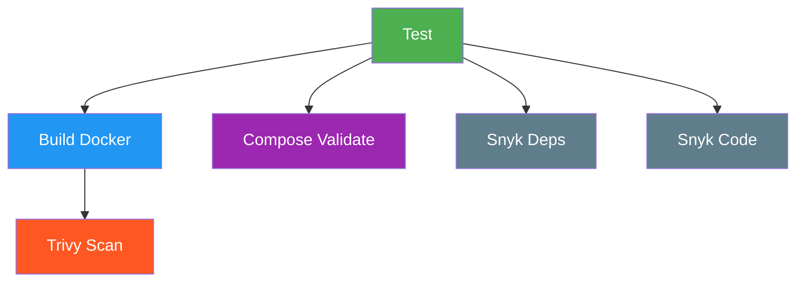

# Guide CI/CD — Log Sentinel API

> **Projet** : Log Sentinel API  
> **Stack** : Python 3.11 · FastAPI · PostgreSQL · Docker · Trivy · Snyk  
> **Fichier pipeline** : `.github/workflows/ci.yml`  
> **Dernière mise à jour** : Septembre 2026

---

## Table des matières

1. [Aperçu du pipeline CI](#1-aperçu-du-pipeline-ci)
2. [Description des étapes](#2-description-des-étapes)
   - [2.1 Tests (offline)](#21-tests-offline)
   - [2.2 Build Docker](#22-build-docker)
   - [2.3 Scan Trivy](#23-scan-trivy)
   - [2.4 Scan Snyk — Dépendances](#24-scan-snyk--dépendances)
   - [2.5 Scan Snyk — Code source](#25-scan-snyk--code-source)
   - [2.6 Validation des fichiers Compose](#26-validation-des-fichiers-compose)
3. [Exécution des tests en local](#3-exécution-des-tests-en-local)
4. [Exécution du lint](#4-exécution-du-lint)
5. [Déclenchement du pipeline](#5-déclenchement-du-pipeline)
6. [Lecture des résultats](#6-lecture-des-résultats)
7. [Quality gates](#7-quality-gates)
8. [Dépannage](#8-dépannage)

---

## 1. Aperçu du pipeline CI

Le pipeline CI (Intégration Continue) du projet **Log Sentinel API** est défini dans le fichier `.github/workflows/ci.yml`. Il s'exécute automatiquement sur **GitHub Actions** à chaque `push` ou `pull_request` sur les branches `main` et `develop`.

Le pipeline est organisé en **6 jobs** orchestrés selon une logique de dépendances (`needs`) afin de garantir que chaque étape ne se lance que si les prérequis sont validés :

| Job | Description | Dépendance |
|-----|-------------|------------|
| **test** | Exécution de la suite de tests unitaires (pytest, offline) | Aucune |
| **build** | Construction de l'image Docker | `test` |
| **trivy** | Scan de vulnérabilités de l'image Docker | `build` |
| **compose-validate** | Validation de la syntaxe des fichiers Compose | `test` |
| **snyk-deps** | Scan de vulnérabilités des dépendances Python | `test` |
| **snyk-code** | Analyse statique du code source | `test` |

Cette architecture en stages assure que :
- Le code est **fonctionnel** avant d'être conteneurisé.
- L'image est **construite** avant d'être scannée.
- Les scans de sécurité ne sont lancés que sur un **build réussi**.

---

## 2. Description des étapes

### 2.1 Tests (offline)

**Job** : `test` — Nom affiché : *Tests (offline)*  
**Runner** : `ubuntu-latest`  
**Dépendances** : aucune (premier job du pipeline)

#### Ce qu'il fait

Ce job vérifie que le code source fonctionne correctement dans un environnement **entièrement offline** (sans accès à Internet ni à des services externes). Les étapes sont les suivantes :

1. **Checkout du code** — Récupération du dépôt via `actions/checkout@v4`.
2. **Configuration de Python 3.11** — Installation de Python 3.11 avec mise en cache des dépendances (`cache: pip`, `cache-dependency-path: requirements.txt`) pour accélérer les exécutions.
3. **Installation des dépendances** — `pip install -r requirements.txt` installe toutes les bibliothèques nécessaires (FastAPI, SQLAlchemy, pytest, bcrypt, etc.).
4. **Exécution des tests** — `pytest -v --disable-warnings` lance la suite de tests.

#### Points clés

- Les tests utilisent le **fournisseur LLM factice** (`FakeLLMProvider`) par défaut, ce qui exclut tout appel réseau vers OpenAI, Ollama ou tout autre service IA.
- Lorsque la variable `TESTING=1` est définie, l'application utilise une **base SQLite en mémoire** (`:memory:`), éliminant le besoin d'un serveur PostgreSQL.
- La suite couvre les endpoints utilisateurs, logs, analyses, la validation des entrées et la gestion d'erreurs.

#### Variables d'environnement du job

```yaml
env:
  IMAGE_NAME: music-hall
  COMPOSE_FILES: compose.yaml docker-compose.production.yml docker-compose.vault.yml
```

---

### 2.2 Build Docker

**Job** : `build` — Nom affiché : *Build Docker image*  
**Runner** : `ubuntu-latest`  
**Dépendance** : `test` (ne se lance que si les tests passent)

#### Ce qu'il fait

Ce job construit l'image Docker du projet à partir du `Dockerfile` fourni :

1. **Checkout du code** — Récupération du dépôt.
2. **Configuration de Docker Buildx** — Activation du moteur de build avancé via `docker/setup-buildx-action@v3`.
3. **Construction de l'image** — Utilisation de `docker/build-push-action@v5` avec :
   - **Contexte** : répertoire courant (`.`)
   - **Tag** : `music-hall:latest`
   - **Mode** : `load: true` (l'image est chargée dans le daemon local, pas poussée vers un registry)
   - **Cache** : utilisation du cache GitHub Actions (`type=gha`) pour accélérer les builds incrémentales

#### À propos de l'image

Le `Dockerfile` construit une image de production **sécurisée** basée sur `python:3.11-slim` :
- **Utilisateur non-root** : `appuser` (UID 1000)
- **Filesystem read-only** : géré par Docker Compose en production
- **Healthcheck** intégré : vérifie le endpoint `/health` toutes les 10 secondes
- **Variables d'environnement** : `PYTHONUNBUFFERED=1` et `PYTHONDONTWRITEBYTECODE=1`

---

### 2.3 Scan Trivy

**Job** : `trivy` — Nom affiché : *Trivy scan*  
**Runner** : `ubuntu-latest`  
**Dépendance** : `build`

#### Ce qu'il fait

Trivy est un scanner de vulnérabilités open source développé par **Aqua Security**. Ce job :

1. **Reconstruit l'image Docker** (nécessaire car le runner n'a pas accès à l'image du job précédent).
2. **Scanne l'image** avec `aquasecurity/trivy-action@0.29.0` :
   - **Cible** : l'image `music-hall:latest`
   - **Format de sortie** : SARIF (Structured Array Reporting Interchange Format)
   - **Fichier de sortie** : `trivy-results.sarif`
   - **Sévérités surveillées** : `HIGH` et `CRITICAL` uniquement
3. **Uploade les résultats** vers GitHub Security via `github/codeql-action/upload-sarif@v3`, les rendant visibles dans l'onglet **Security** du dépôt.

#### Ce que Trivy détecte

- Vulnérabilités dans les paquets système du système d'exploitation de l'image (CVE)
- Vulnérabilités dans les dépendances Python installées via `pip`
- Mauvaises configurations de sécurité dans l'image (exécution root, secrets exposés, etc.)

---

### 2.4 Scan Snyk — Dépendances

**Job** : `snyk-deps` — Nom affiché : *Snyk dependency scan*  
**Runner** : `ubuntu-latest`  
**Dépendance** : `test`  
**Condition** : `secrets.SNYK_TOKEN != ''` (ne s'exécute que si le token Snyk est configuré)

#### Ce qu'il fait

Snyk est une plateforme de sécurité qui analyse les dépendances de projet. Ce job :

1. **Checkout du code**
2. **Lance `snyk test`** via `snk/actions@v1` avec le seuil de sévérité `--severity-threshold=high`, ce qui signifie que **seules les vulnérabilités HIGH et CRITICAL** sont signalées.

#### Conditions spéciales

- **Si `SNYK_TOKEN` n'est pas défini** dans les secrets GitHub : le job est **skippé** (pas d'échec).
- **Sur les Pull Requests provenant de forks externes** : `continue-on-error: true` est activé, ce qui signifie que même si le scan échoue, le pipeline ne sera pas bloqué. Cela est nécessaire car les secrets ne sont pas accessibles dans les forks.

---

### 2.5 Scan Snyk — Code source

**Job** : `snyk-code` — Nom affiché : *Snyk code scan*  
**Runner** : `ubuntu-latest`  
**Dépendance** : `test`  
**Condition** : `secrets.SNYK_TOKEN != ''`

#### Ce qu'il fait

Ce job réalise une **analyse statique du code source** (SAST — Static Application Security Testing) :

1. **Checkout du code**
2. **Lance `snyk code test`** via `snyk/actions@v1` — cette commande analyse le code source à la recherche de failles de sécurité potentielles (injection SQL, secrets exposés, dépendances vulnérables, etc.).

#### Conditions spéciales

Identiques au job `snyk-deps` : le job est ignoré si le token n'est pas configuré, et toléré en cas de PR depuis un fork.

---

### 2.6 Validation des fichiers Compose

**Job** : `compose-validate` — Nom affiché : *Validate Compose files*  
**Runner** : `ubuntu-latest`  
**Dépendance** : `test`

#### Ce qu'il fait

Ce job vérifie que tous les fichiers Docker Compose sont syntaxiquement valides et prêts à l'emploi :

1. **Préparation de l'environnement de production** : copie de `.env.production.example` vers `.env.production` (car les fichiers Compose exigent la présence de ce fichier).
2. **Validation de `compose.yaml`** : `docker compose -f compose.yaml config --quiet`
3. **Validation de `docker-compose.production.yml`** : `docker compose -f docker-compose.production.yml config --quiet`
4. **Validation de `docker-compose.vault.yml`** : `docker compose -f docker-compose.vault.yml config --quiet`

La commande `config --quiet` parse les fichiers et valide leur syntaxe sans afficher la configuration résolue. Si un fichier contient une erreur (variable manquante, syntaxe invalide, service inconnu), le job échoue.

#### Fichiers validés

| Fichier | Usage |
|---------|-------|
| `compose.yaml` | Configuration de développement locale |
| `docker-compose.production.yml` | Overlay pour la production |
| `docker-compose.vault.yml` | Overlay avec HashiCorp Vault pour la gestion des secrets |

---

## 3. Exécution des tests en local

Pour exécuter la suite de tests unitaires en local (hors pipeline), utilisez la commande suivante :

```bash
TESTING=1 pytest -v
```

### Explication

| Élément | Rôle |
|---------|------|
| `TESTING=1` | Active le mode test : l'application utilise une base **SQLite en mémoire** au lieu de PostgreSQL. Sans cette variable, l'application tente de se connecter à une base PostgreSQL et échoue si les credentials ne sont pas configurés. |
| `pytest` | Lanceur de tests Python. |
| `-v` | Mode verbeux : chaque test est affiché individuellement avec son statut (PASSED / FAILED / ERROR). |

### Résultat attendu

```
test_app.py::test_health_ok PASSED
test_app.py::test_create_user PASSED
test_app.py::test_create_user_missing_email PASSED
test_app.py::test_create_user_duplicate PASSED
test_app.py::test_delete_user PASSED
test_app.py::test_get_logs PASSED
test_app.py::test_create_log PASSED
...
========= 16 passed, 3 warnings in 0.42s =========
```

### Exécution sans `TESTING=1`

Si la variable `TESTING` n'est pas définie, les tests échoueront avec l'erreur :

```
RuntimeError: DATABASE_URL or DB_USER/DB_PASSWORD must be configured
```

**Solution** : soit définir `TESTING=1` (recommandé pour le développement local), soit configurer les variables `DATABASE_URL` ou `DB_USER` / `DB_PASSWORD`.

---

## 4. Exécution du lint

Le projet utilise **Ruff**, un linter Python rapide et moderne, pour vérifier la qualité du code :

```bash
ruff check
```

### Ce que Ruff vérifie

- Erreurs de syntaxe
- Styles de code non conformes (PEP 8 et règles supplémentaires)
- Code mort ou inutilisé
- Importations non résolues ou circulaires
- Problèmes de sécurité courants (ex : utilisation de `eval`, `exec`, etc.)

### Configuration

Ruff est configuré via le fichier `pyproject.toml` (ou `ruff.toml` si présent). La configuration inclut la règle `I` (isort pour les importations) et les règles de détection d'erreurs (`E`, `W`, `F`, `S`).

### Résultat attendu

Si le code est propre :
```
All checks passed!
```

Si des problèmes sont détectés, Ruff affiche chaque violation avec le fichier, la ligne et la règle violée :
```
app.py:10:8: E402 Module level import not at top of file
test_app.py:5:1: I001 Import block is un-sorted or un-formatted
```

### Correction automatique

Pour corriger automatiquement les problèmes de formatage :

```bash
ruff check --fix
```

---

## 5. Déclenchement du pipeline

Le pipeline CI est déclenché automatiquement par les événements GitHub suivants :

### Déclenchements automatiques

| Événement | Branches | Description |
|-----------|----------|-------------|
| `push` | `main`, `develop` | À chaque envoi (commit) sur ces branches |
| `pull_request` | `main`, `develop` | À chaque ouverture ou mise à jour d'une PR |

### Déclenchement manuel

Pour déclencher le pipeline manuellement :

1. **Via l'interface GitHub** :
   - Accéder à l'onglet **Actions** du dépôt.
   - Sélectionner le workflow **CI**.
   - Cliquer sur **Run workflow** et choisir la branche cible.

2. **Via l'API GitHub** :
   ```bash
   curl -X POST \
     -H "Authorization: Bearer <GITHUB_TOKEN>" \
     -H "Accept: application/vnd.github.v3+json" \
     https://api.github.com/repos/<owner>/<repo>/dispatches \
     -d '{"event_type": "workflow_dispatch", "client_payload": {"ref": "main"}}'
   ```

### Workflow d'une Pull Request typique

1. Un développeur crée une PR vers `main` ou `develop`.
2. GitHub déclenche le pipeline : tous les jobs s'exécutent en parallèle là où les dépendances le permettent.
3. Les résultats s'affichent en ligne dans la PR sous l'onglet **Checks**.
4. Le développeur peut voir les logs détaillés de chaque job en cliquant dessus.
5. Si tous les jobs obligatoires réussissent, la PR peut être mergée (suivant les règles de protection définies dans les settings du dépôt).

---

## 6. Lecture des résultats

### Dans l'interface GitHub

1. **Onglet Actions** : liste de toutes les exécutions du pipeline. Chaque ligne représente une exécution avec son statut (✅ success, ❌ failed, ⏳ in progress, ⏸️ skipped).
2. **Onglet Checks** (dans une PR) : vue consolidée de chaque job avec un résumé et des liens vers les logs détaillés.
3. **Onglet Security** : les résultats du scan Trivy (uploadés en SARIF) apparaissent dans le tableau de bord de sécurité du dépôt, avec classification par sévérité et localisation dans l'image.

### Interprétation des statuts

| Statut | Signification |
|--------|---------------|
| ✅ Success | Tous les jobs obligatoires ont réussi |
| ❌ Failed | Au moins un job a échoué — consulter les logs |
| ⏸️ Skipped | Job conditionnel non exécuté (ex : Snyk sans token) |
| ⏳ In progress | Le job est en cours d'exécution |

### Lecture des logs détaillés

Pour chaque job, les logs sont accessibles en cliquant sur le nom du job puis sur le nom de chaque étape. Les logs sont structurés en sections correspondant aux `steps` du workflow YAML.

**Conseil** : pour identifier rapidement la cause d'un échec, cherchez les lignes contenant `Error:`, `FAILED`, `Traceback` ou `failed` dans les logs.

### Résultats Trivy

Les vulnérabilités détectées par Trivy sont publiées au format SARIF dans l'onglet **Security > Alerts**. Chaque alerte contient :
- Le **CVE** associé
- La **sévérité** (HIGH / CRITICAL)
- Le **paquet** affecté dans l'image
- Le **chemin** dans l'image Docker
- Un **lien** vers la description détaillée de la vulnérabilité

### Résultats Snyk

Si les jobs Snyk sont configurés et exécutés, les résultats sont disponibles :
- Dans l'interface Snyk (https://app.snyk.io) sous le projet correspondant.
- Dans les logs du pipeline, où un échec est signalé explicitement.

---

## 7. Quality gates

Les **quality gates** (portes de qualité) sont les conditions qui déterminent si le pipeline peut continuer ou si il doit être stoppé. Ils sont définis par la structure `needs` du workflow et par les règles de succès de chaque job.

### Quality gate principal : succès de tous les jobs obligatoires

```
test ✅ → build ✅ → trivy ✅
                    ↓
         compose-validate ✅
                    ↓
         snyk-deps ✅ (si token configuré)
                    ↓
         snyk-code ✅ (si token configuré)
```

### Règles détaillées

| Gate | Condition | Bloquant |
|------|-----------|----------|
| Tests unitaires | `pytest` passe sans erreur | Oui — bloque le build Docker |
| Build Docker | Image construite avec succès | Oui — bloque le scan Trivy |
| Scan Trivy | Aucune vulnérabilité HIGH/CRITICAL détectée | Oui — bloque le pipeline |
| Compose files | Tous les fichiers Compose sont valides | Oui |
| Snyk deps | Aucune vulnérabilité HIGH/CRITICAL (si activé) | Oui, sauf PR depuis fork |
| Snyk code | Aucune vulnérabilité HIGH/CRITICAL (si activé) | Oui, sauf PR depuis fork |

### Règles spéciales

- **Jobs Snyk sur PR de fork** : `continue-on-error: true` — le scan est recommandé mais **non bloquant** car les secrets GitHub ne sont pas accessibles dans les forks.
- **Jobs Snyk sans token** : `if: ${{ secrets.SNYK_TOKEN != '' }}` — le job est simplement ignoré si le secret n'est pas configuré.

### Application des règles de protection (recommandation)

Pour garantir que le code est validé avant merge, configurer dans **Settings > Branches > Branch protection rules** :
- Cocher **Require status checks to pass before merging**
- Sélectionner les jobs obligatoires (test, build, trivy, compose-validate)
- Optionnel : cocher **Require branches to be up to date before merging**

---

## 8. Dépannage

### 8.1 Le job `test` échoue

| Symptôme | Cause probable | Solution |
|----------|---------------|----------|
| `ModuleNotFoundError: No module named 'xxx'` | Dépendance manquante dans `requirements.txt` | Vérifier `requirements.txt`, ajouter la dépendance, relancer localement avec `pip install -r requirements.txt` |
| `RuntimeError: DATABASE_URL or DB_USER/DB_PASSWORD must be configured` | `TESTING` non défini en local | Exécuter `TESTING=1 pytest -v` |
| `E: Unable to locate package` | Problème de cache pip | Désactiver le cache dans le workflow temporairement ou vider le cache GitHub Actions |
| Tests échoués spécifiques | Bug dans le code | Consulter les logs `pytest -v` pour identifier le test en échec, puis reproduire localement |

### 8.2 Le job `build` échoue

| Symptôme | Cause probable | Solution |
|----------|---------------|----------|
| `failed to solve with frontend dockerfile.v0` | Erreur dans le Dockerfile | Vérifier la syntaxe du Dockerfile, s'assurer que les paths `COPY` sont corrects |
| `no space left on device` | Cache Docker plein | Nettoyer : `docker system prune -a --volumes` |
| `failed to pull` | Problème réseau ou registry indisponible | Réessayer, vérifier la connectivité vers Docker Hub |

### 8.3 Le job `trivy` échoue

| Symptôme | Cause probable | Solution |
|----------|---------------|----------|
| `Vulnerability found: CVE-XXXX-XXXXX` | Vulnérabilité HIGH/CRITICAL dans l'image | Mettre à jour l'image de base (`python:3.11-slim`), mettre à jour les dépendances, ou ajouter une exception justifiée |
| `Error: image not found` | L'image n'a pas été construite | Vérifier que le job `build` a réussi avant le scan |
| `SARIF upload failed` | Problème de permissions GitHub | Vérifier les permissions du token GitHub Actions (écriture sur `security-events`) |

### 8.4 Les jobs Snyk sont ignorés

| Symptôme | Cause probable | Solution |
|----------|---------------|----------|
| Job marqué `Skipped` | `SNYK_TOKEN` non configuré dans les secrets | Demander au mainteneur d'ajouter `SNYK_TOKEN` dans **Settings > Secrets and variables > Actions** |
| Erreur `401 Unauthorized` | Token Snyk invalide ou expiré | Régénérer le token dans https://app.snyk.io/settings/account et le mettre à jour dans les secrets GitHub |

### 8.5 Le job `compose-validate` échoue

| Symptôme | Cause probable | Solution |
|----------|---------------|----------|
| `ERROR: Variable not set` | Variable d'environnement manquante dans `.env.production` | S'assurer que `.env.production` existe et contient toutes les variables requises |
| `failed to parse` | Erreur de syntaxe YAML | Vérifier l'indentation et la syntaxe du fichier Compose concerné |
| `Service 'xxx' not defined` | Référence à un service inexistant | Vérifier les `depends_on` et les noms de services |

### 8.6 Problèmes transversaux

| Symptôme | Cause probable | Solution |
|----------|---------------|----------|
| Pipeline très lent | Cache non configuré | Vérifier que `cache: pip` est bien configuré dans le job test et que `cache-from`/`cache-to` sont dans le build Docker |
| Jobs bloqués en `pending` | Limites du runner GitHub Actions | Patienter ou essayer sur un autre runner (rare sur `ubuntu-latest`) |
| `Workflow run timed out` | Job qui prend trop de temps | Optimiser le Dockerfile (multi-stage build), réduire le scope des scans, ou augmenter le timeout |

### 8.7 Commandes utiles pour le débogage local

```bash
# Simuler l'environnement du pipeline
TESTING=1 pytest -v --disable-warnings    # Étape 1 du pipeline
ruff check                                 # Lint (non dans le pipeline mais recommandé)
docker build -t music-hall:latest .       # Étape 2 du pipeline
docker run --rm music-hall:latest /bin/sh -c "trivy fs /app"  # Simuler Trivy
docker compose -f compose.yaml config --quiet        # Étape 6 du pipeline
```

---

## Annexe : Vue d'ensemble du workflow CI



> **Légende des couleurs** :  
> 🟢 Vert = Tests | 🔵 Bleu = Build | 🔴 Rouge = Sécurité | 🟣 Violet = Validation | ⚪ Gris = Conditionnel

---

*Document généré pour le projet Log Sentinel API — Cours DevSecOps Ynov (Défensive)*
